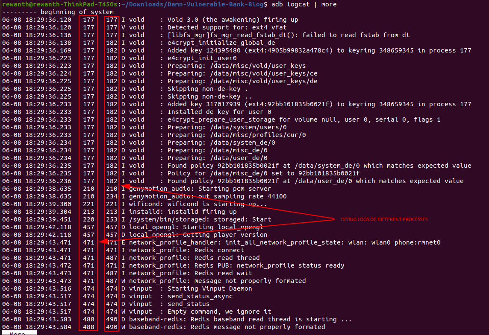
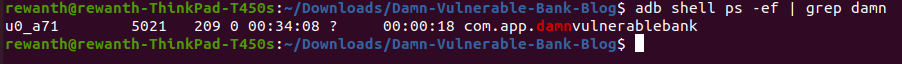
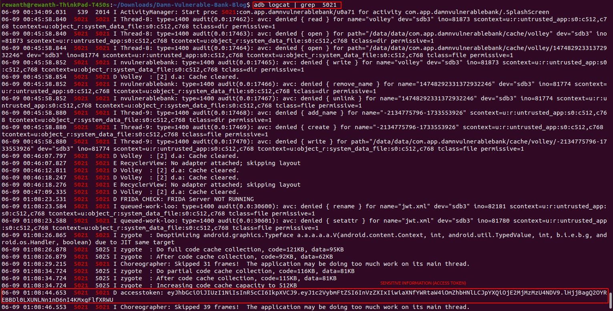

## Sensitive information disclosure

There are multiple ways for sensitive information leakage in android applications. The most common ones are:

* Hardcoded sensitive information
* Leakage via logcat/debug logs

### Hardcoded sensitive information

We have already seen this in the section where we were replicating the cryptographic functions locally. The secret key that's used for crypting purposes is hardcoded in the source code of the application which allowed us to decrypt the encrypted request and responses.

### Adb logcat

We have been using the application for a while. So, let's check the logs via `adb logcat`.



In the above image, we can see logs of multiple processes. Our target is to find the logs specific to our application. Search for the Process ID (PID) of the damn vulnerable bank application.

```bash
adb shell ps -ef | grep damn
```



Now, grep `adb logcat` output with the process ID (PID) specific to our target application.

```bash
adb logcat | grep 5021
```



