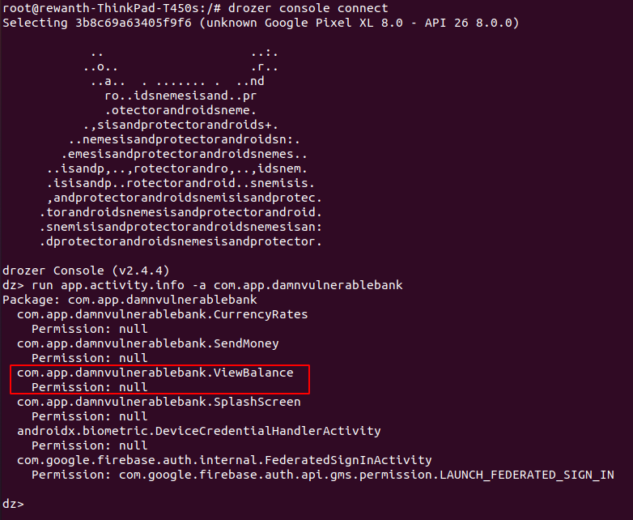
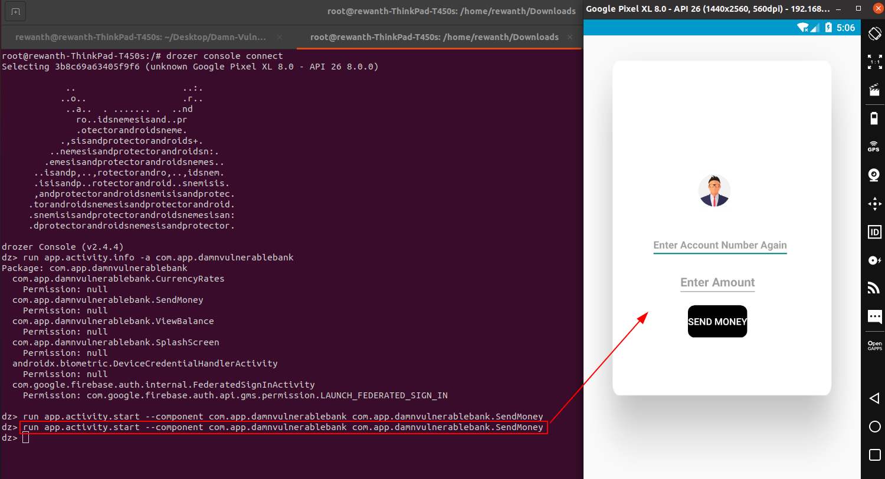
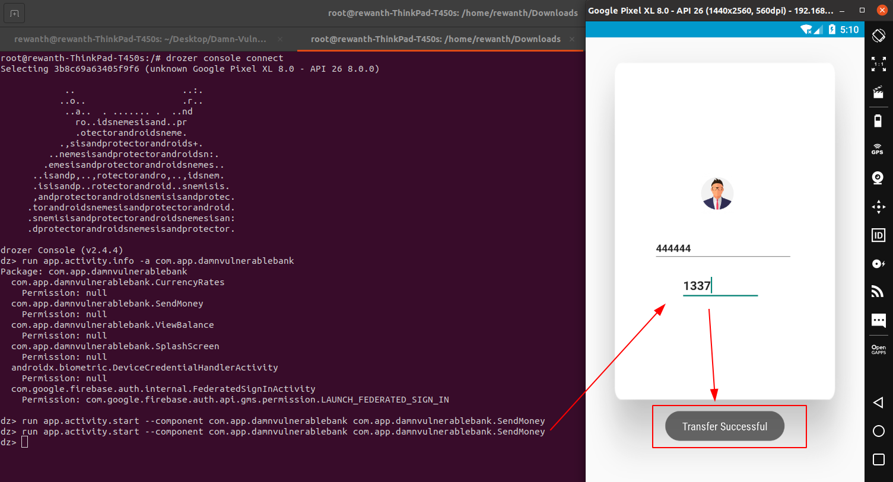
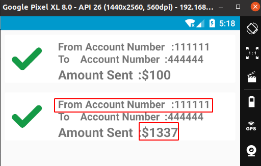

## Exploiting exported activities

Everything that you see in an android app is kind of being done via an activity. For example, in the given application the login screen, the splash screen, etc. everything is an activity. According to Android developer docs, *An activity is a single, focused thing that the user can do.*

### Exported activities

An exported activity is the one that can be accessed by external components or apps. We can say that exported activities are like `Public` functions in Java, any other parent class or even package can call them. Some activities are built to be user specific, but if those activities are exported and not protected, that creates issue.

We will use drozer to perform this check. Refer to tools page.

Interesting, we can see multiple exported activities with no permission checks. If an attacker can invoke these activities without authentication, it can create potential financial impact.

That's amazing. We are able to invoke the `SendMoney` activity without giving in the credentials. Let's see if we can transfer money to other accounts.

We can get the account numbers list from the github page. Enter one of the valid account numbers to transfer the amount. For ex, user4 account number is 444444.

Login as `user4` and get confirmation on the exploit.

Without authneticating into the application, we are able to exploit the sensitive exported activity and transfer amount to other bank accounts.
