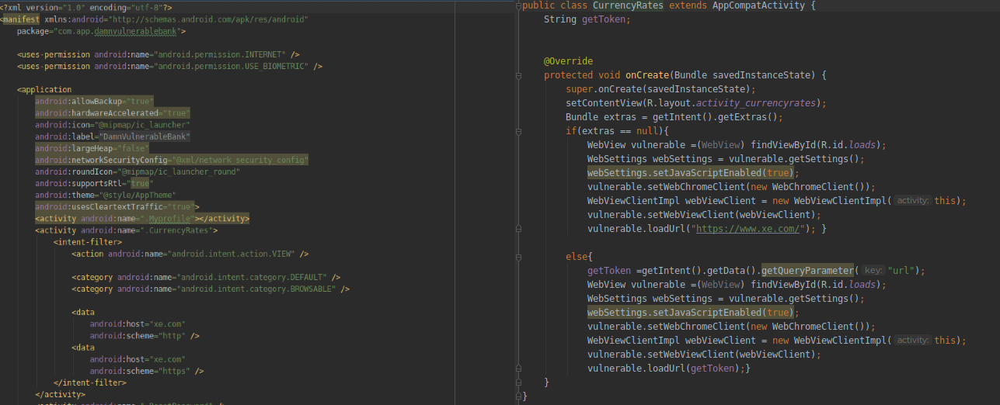
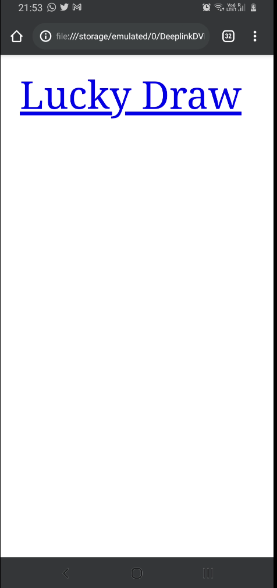
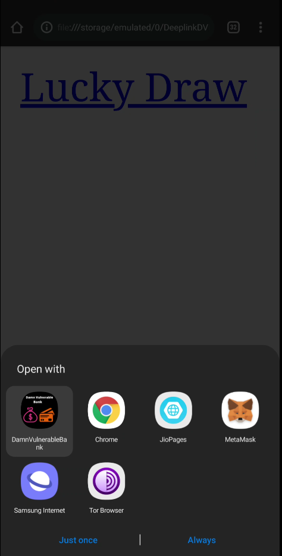
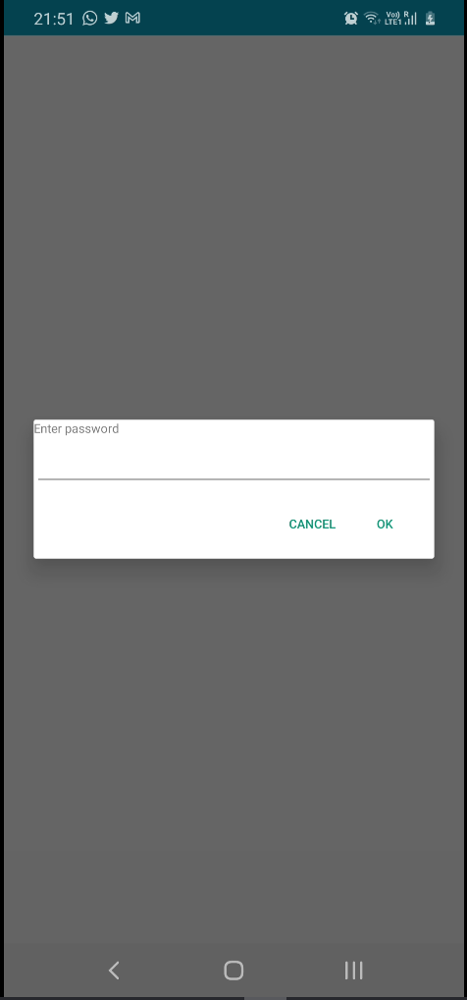

## Exploiting webview via deeplink

Android WebView is a system component for the Android operating system (OS) that allows Android apps to display content from the web directly inside an application. Deep links are a type of link that send users directly to an app instead of a website or a store.

### Exploration

In manifest file we can see the CurrencyRates, this activity accepts a deeplink to open webview with user input URL. Now in manifest as we can see that we have a deep link with http schema and xe.com as host and in CurrencyRates activity we can see webview configuration where if a `url` paramter is provided then webview will render that URL without verifying host and url given this can be used to open any URI within and also can be used to get an XSS in the webview




To get an XSS prompt we will need to pass javascript to be loaded in webview we can either do this by hosting XSS payload on our website else call javascript in URI itself, we are here demonstrating via javascript URI itself,therefore for this case our final URL will looks as `https://xe.com?url=javascript:prompt('Enterpassword')`


But to get a working POC either we need to load it via HTML or call via adb, since HTML can be easily done so we
For this we can create a html file with code as below

```html
<!DOCTYPE html>
<html>
<head>
<title></title>
</head>
<body>
<a href="https://xe.com?url=javascript:prompt('Enter password')">Lucky Draw</a>
</body>
</html>
```

Now load this page from mobile browser

 


As you can see we get option of our Vuldroid app just click on it to confirm, now as you can see we get the XSS prompt sucessfully


