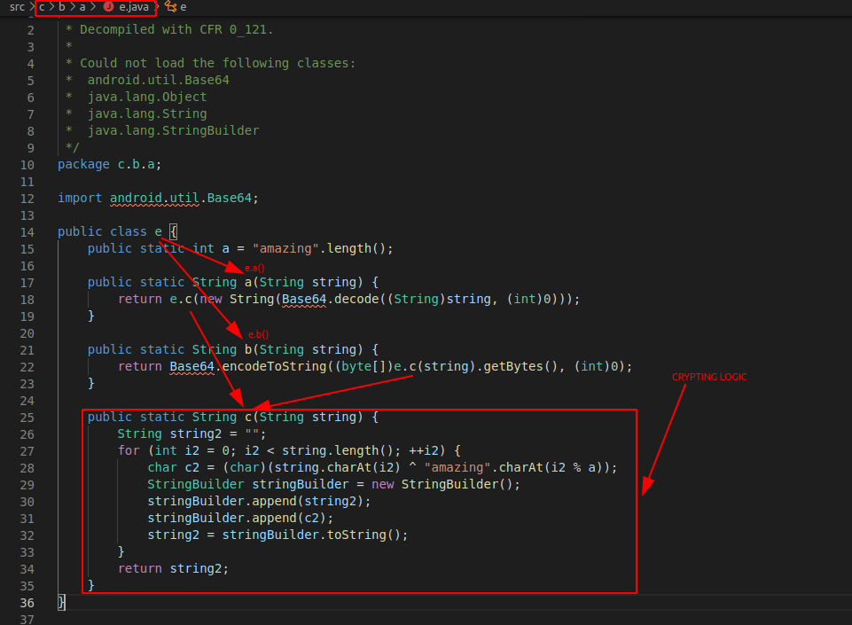
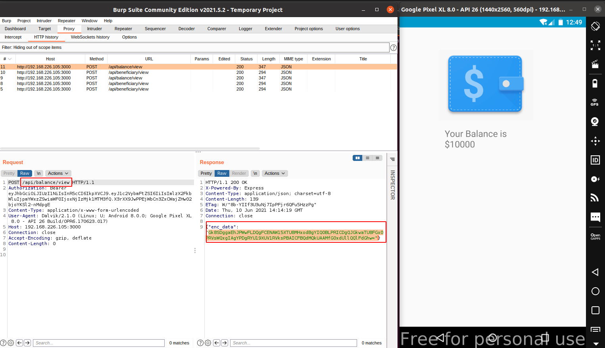
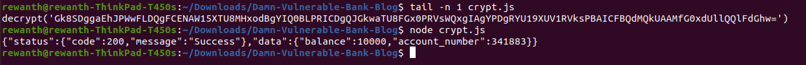

## Recreating encrypt and decrypt functions locally

We achieved great things so far. We managed to view the decrypted data of both request, response and now we even have the ability to tamper with it. But writing our test cases in frida scripts for all endpoints with different parameters is chaos job. If we can somehow manage to replicate the encrypt and decrypt functions on our local systems, we can encrypt and decrypt intercepted data with ease.

From the above analysis, we can conclude the `e.a()` and `e.b()` functions inside class `c.b.a.e` are responsible for encrypt and decrypt functions. Open the file in code editor for further analysis.



Woah! We found the encrypt, decrypt logic and our goal is to replicate this locally to ease the pentesting process. Re-build equivalent code locally. I prefer coding in NodeJS.

```javascript
const SECRET = 'amazing';
const SECRET_LENGTH = SECRET.length;

const operate = (input) => {
  let result = "";
  for (let i in input) {
    result += String.fromCharCode(input.charCodeAt(i)^SECRET.charCodeAt(i%SECRET_LENGTH));
  }
  return result;
}

const decrypt = (encodedInput) => {  
  let input = Buffer.from(encodedInput, 'base64').toString();
  let dec = operate(input);
  console.log(dec);
  return dec;
}

const encrypt = (input) => {
  let enc = operate(input.toString());
  let b64 = Buffer.from(enc).toString('base64');
  console.log(b64);
  return b64;
}
```

Now, we have successfully re-built the encryption and decryption functions locally. When we intercept the request, we can use these to decrypt the encrypted data.



We have the below string in the response.

```json
{"enc_data":"Gk8SDggaEhJPWwFLDQgFCENAW15XTU8MHxodBgYIQ0BLPRICDgQJGkwaTU8FGx0PRVsWQxgIAgYPDgRYU19XUV1RVksPBAICFBQdMQkUAAMfG0xdUllQQlFdGhw="}
```

Pass the above encrypted text to the `decrypt` function you built locally.

```javascript
decrypt("Gk8SDggaEhJPWwFLDQgFCENAW15XTU8MHxodBgYIQ0BLPRICDgQJGkwaTU8FGx0PRVsWQxgIAgYPDgRYU19XUV1RVksPBAICFBQdMQkUAAMfG0xdUllQQlFdGhw=")
```



Perfect! Our code is working :-)
