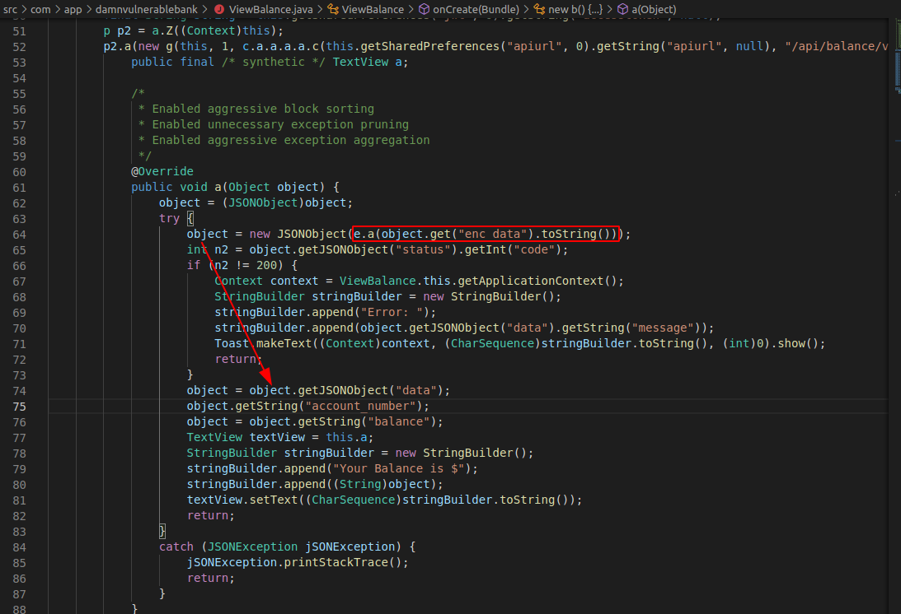
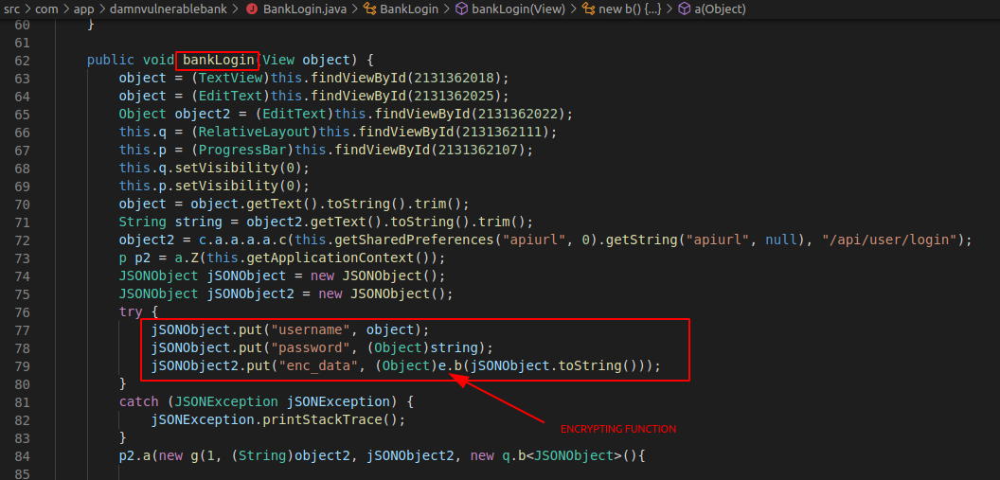
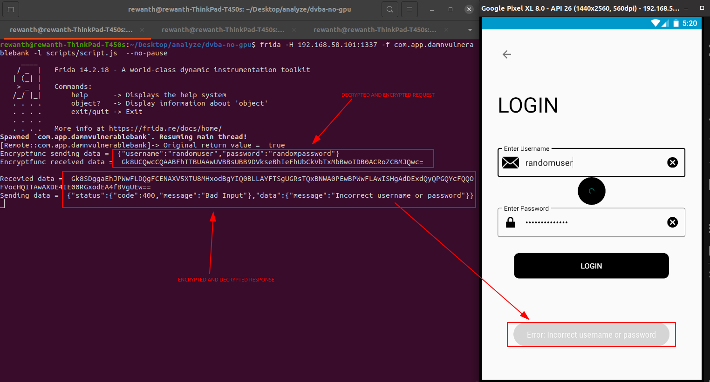

## Decrypting response

We can see all the intercepted data is encrypted. It means when we get the response from the server, the application has to decrypt it inorder to perform subsequent operations. We extracted java code from the apk with apkx tool. Since, the decryption is inevitable, let's open a random API endpoint and analyze the java code. I'm opening `ViewBalance.java` for analysis.

If you remember, in the previous section, we have seen the intercepted burpsuite data is having `enc_data` as key. So, the application has to pick the value of, `enc_data` for it to decrypt. Search for `enc_data` in `ViewBalance.java`.



A small snippet from the above screenshot.

```java
...
import c.b.a.e;
...
object = new JSONObject(e.a(object.get("enc_data").toString()));
int n2 = object.getJSONObject("status").getInt("code");
...
```

We can see from the above snippet that this piece of code fetches data from `enc_data`, passes it to `e.a` function, makes it a JSON object and stores in `object` variable. It means our encrypted data is being passed to `e.a` function for processing.

Our primary task is to hook the `e.a` function to see the data it receives and sends. Similar to root detection bypass, we need to leverage frida to achieve this goal. Do not tamper anything yet.

```javascript
/*
Root detection bypass script here
*/

// Decrypting response
setTimeout(function() {
    Java.perform(function() {

        var decryptFunc = Java.use("c.b.a.e");

        decryptFunc.a.implementation = function(enc_data) {
            console.log("Recevied data = ", enc_data)
            let retval = this.a(enc_data);
            console.log("Sending data = ", retval);
            return retval
        }
    })
}, 10);
```


We can successfully see the decrypted response but its not useful for us. For us to perform pentesting, we need to tamper with the requests but unfortunately even the request body is being encrypted before sending it to the server. It means, the application is encrypting it before sending it to the server. Our task is to find the function encrypting the data.

If you analyze the code of `ViewBalance.java`, we can't see any request parameters in it because it doesn't have any request parameters. We need to find another API that contains request body. For example, let's randomly pick `BankLogin.java` as they will likely have username and password as body parameters. Analyze the code to find the encryption snippet.



As we can see similar to decrypt function, we have encrypt function here but really obfuscated. The real data here, i.e username and password are being passed to `e.b()` for further processing. So, we need to hook `e.b()` to view unencrypted data.

```javascript
/*
Root detection bypass script here
*/

/*
Decrypt response script here
*/

// Decrypting request
setTimeout(function() {
    Java.perform(function() {

        var encryptFunc = Java.use("c.b.a.e");

        encryptFunc.b.implementation = function(enc_data) {
            console.log("Encryptfunc sending data = ", enc_data)
            let retval = this.b(enc_data);
            console.log("Encryptfunc received data = ", retval);
            return retval
        }
    })
}, 10);
```



