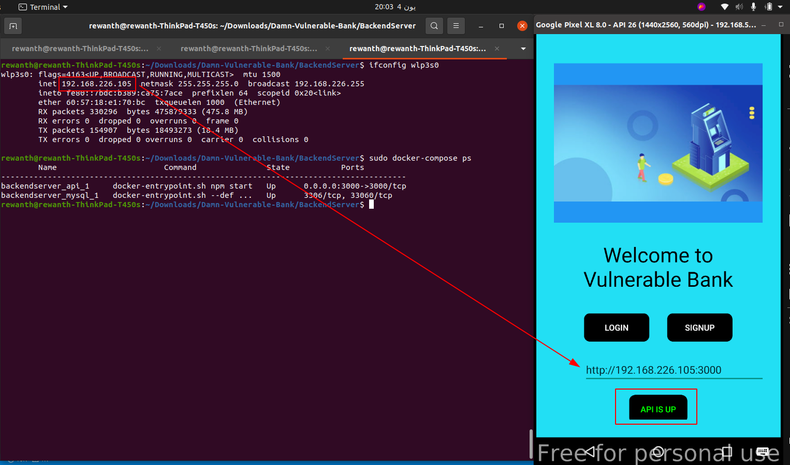
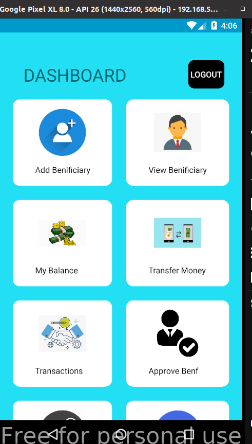
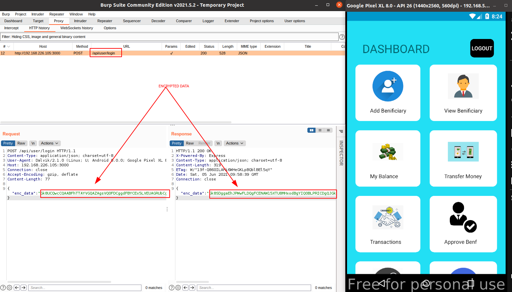

## Footprinting the application

Footprinting is the crucial part in pentesting any application. It allows us to look more into multiple things.

Start the backend server, enter the URL in the designated field and check for health status. Perform health check to make sure the API is up and running.

There are some pre-created accounts for testing but nevertheless you can still sign up for the new account.

You can continue to explore the application but all the data is being sent to the server. Let's use burpsuite to intercept the traffic.

Turn on the interceptor in burp suite, make sure you are listening on all interfaces and try re-running the application with frida. Now, login into the application and you can see similar output on your burpsuite.

The application is using REST API as its backend and in every API in the body of POST request, we will usually see data but here instead both the request and response are encrypted. It means the application is performing encryption and decryption before sending the requests.

Consdering we are seeing REST API, we need to look for API vulnerabilities. But both request and response are encrypted and we can't tamper them. In order for us to tamper with the request and response, we have to decrypt them first. Explore the code till you find this encryption and decryption functions.

* Decrypting response
* Recreating crypto functions
