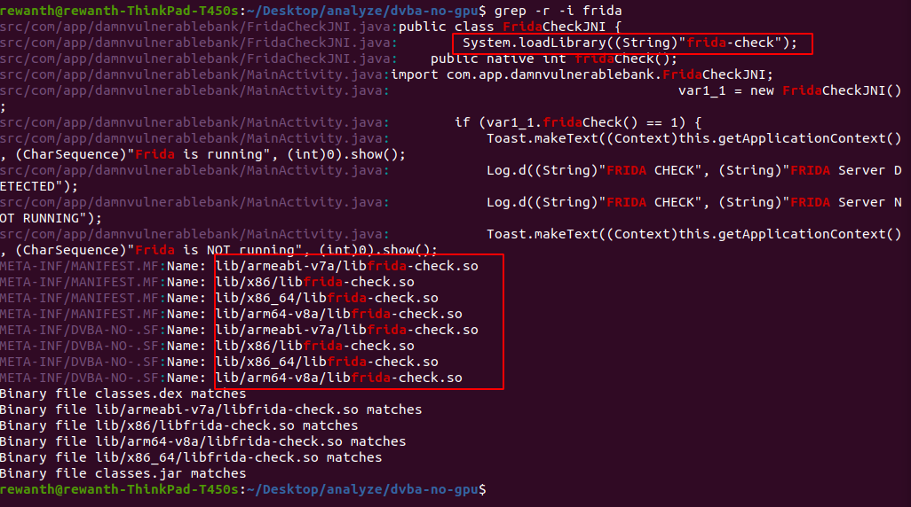
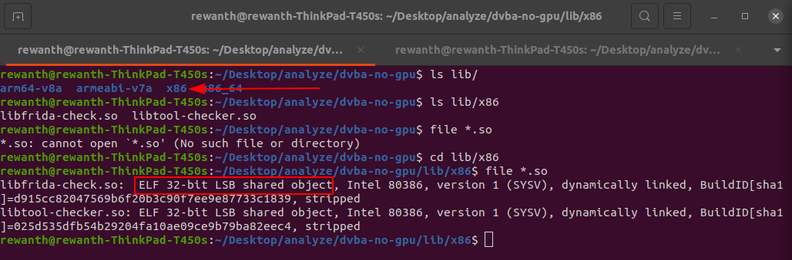
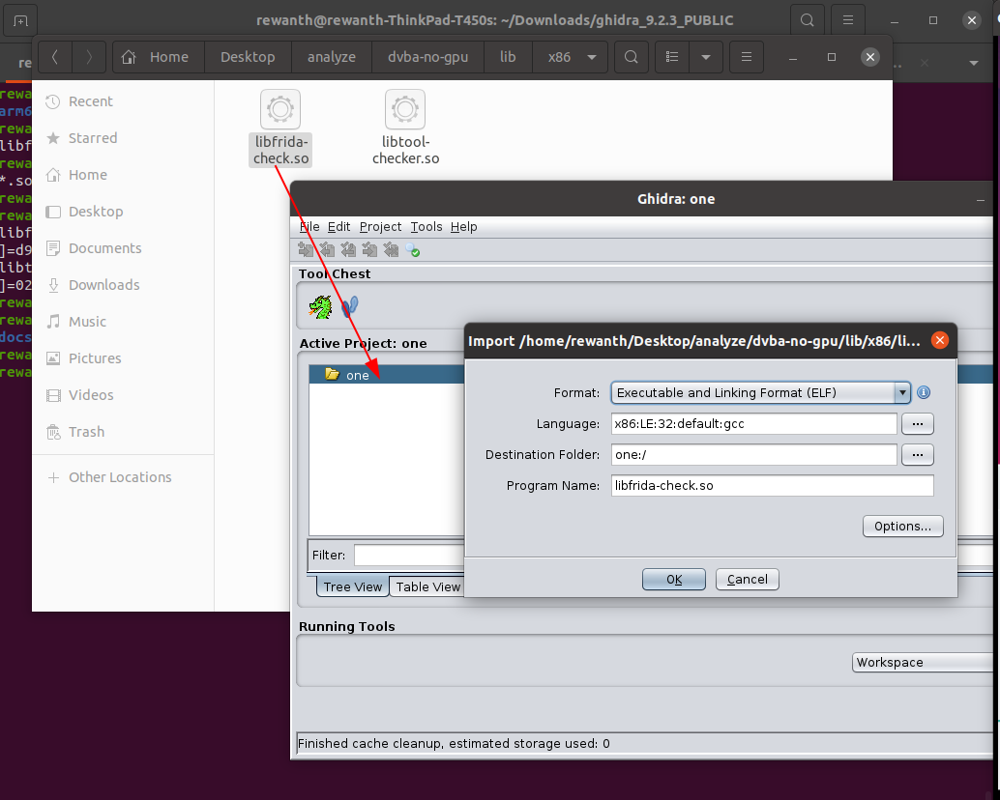
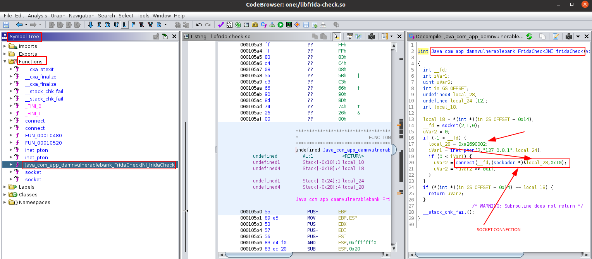
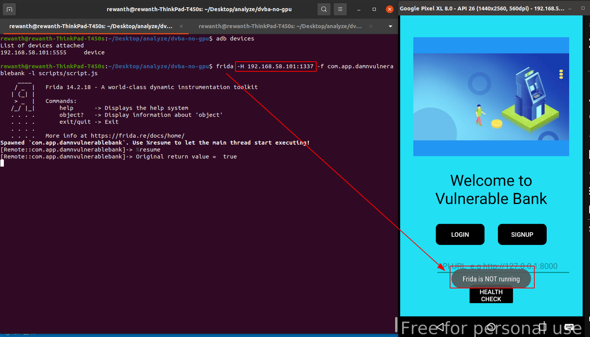

## Bypassing hooking method (frida) detection check

Look into the code for traces of frida to find the piece of code that looks for method hooking detection.

```bash
grep -r -i frida
```



We can see from the above image, there is a `lib/` folder and `System.loadLibrary((String)"frida-check")`. This means the application is calling a method written in native code to perform the method hooking/frida check. Let's open the `lib/` folder to see what it is having. Since we are using genymotion and it runs on `x86` architecture, let's check that directory. We can see some `*.so` files and they are executable files.



Our target is to analyze these library files. To analyze these library files, you will need a tool like IDA/ghidra. Let's use ghidra because it has support to multiple architectures with free of cost.

### Binary analysis with ghidra

Drag and drop the `libfrida-check.so` file to ghidra, select all the default options, and once its loaded double click on the file name to open ghidra. 



This isn't a full strech course on binary analysis, so we skip the basics and try to get started with the analysis.



You can see the pseudo code of the `fridaCheck` function on the right side. In line 20, we can see a socket connection. The application is trying to connect to particular port and depending on the status, its returning some value. In order to perform socket connection, it requires a `host` and `port` value and we can see in line 20, its utilizing data in `local_28` which is `0xa2690002`.

In most cases, the binaries contain code in big-endian format. So, we need to convert `0xa2690002` to actual value. This is having 8 bits, we have to split it into half. Now, it will become `0xa269` and `0x0002`. In order to convert them from big-endian to decimal value, we have to swap the first 2 and last 2 bits.

`0xa269` becomes `0x69a2` whose decimal equivaluent is `27042`.

These values are being passed to `connect` function which makes a socket connection. So, this must be the port number, the application is trying to connect. As we know frida runs on client server architecture. Frida's default port is `27042`.

In short, the application is trying to make a socket connection to port `27042` to check if frida is running or not. If frida is running, `27042` will be occupied. Depending on whether the application is able to make socket connection to port `27042`, we decide if frida is running or not.

### Bypassing frida detection check

Ideally, the application is looking for default port of frida only. Bypassing this is simple, we will just need to run frida on another port.

Kill the frida server in the emulator and try running it another port like `1337`.

```bash
emulator$ ./frida-server-14.2.18-android-x86 -l 0.0.0.0:1337
```

```bash
ubuntu$ frida -H $DEVICE_IP:1337 -f com.app.damnvulnerablebank -l scripts/script.js 
```



You can see from the above image, even when we are hooking the application with frida, it still says `frida is not running`. We bypassed both frida detection and root detection checks.
