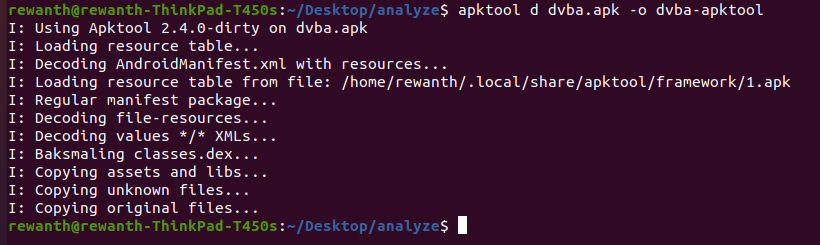
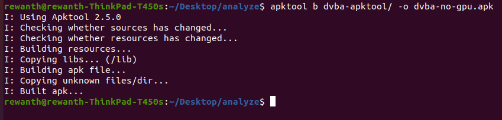
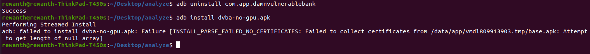
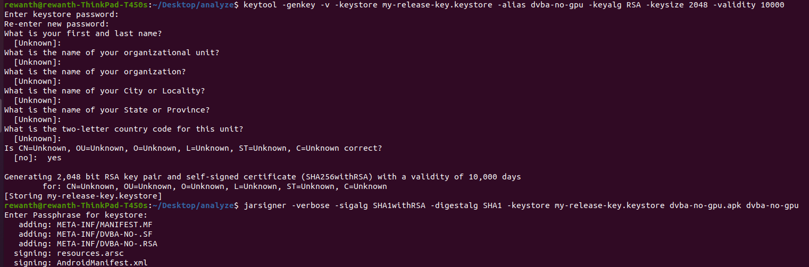
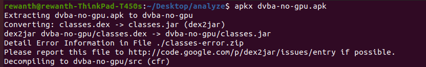
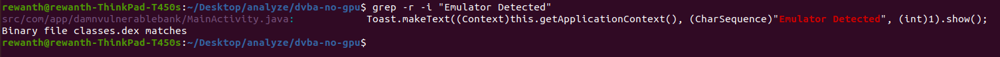
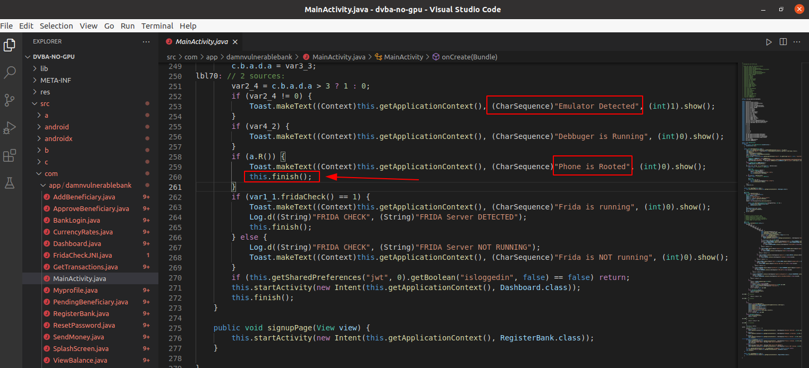

## Bypass GPU detection

### Run the application

Try running the application. It doesn't work.


Looks like the app isn't built to work in an emulator. Let's fix it :-)

### Reverse the android application

Decompile the application with `apktool` to view the `AndroidManifest` file.

```bash
apktool d dvba.apk -o dvba-apktool
```



Observe the `AndroidManifest` for a while to see if something is responsible for not allowing the application to run in an emulator. The `hardwareAccelerated` flag is set to `true`, that means the application is planning to utilize the mobile's GPU resources to get it running. Here's the catch! Unfortunately, emulators doesn't run with GPU. At least, the genymotion emulator which we are using doesn't have a GPU and that's causing the application to crash.

Change the `hardwareAccelerated` to `false`, re-build the application and try running it.



Now, try installing the new apk.



Failed to install due to certificate issues. Create certificates and sign the new apk.

Create a release key keystore

```bash
keytool -genkey -v -keystore my-release-key.keystore -alias dvba-no-gpu -keyalg RSA -keysize 2048 -validity 10000
```

Sign the new built apk with the release key

```bash
jarsigner -verbose -sigalg SHA1withRSA -digestalg SHA1 -keystore my-release-key.keystore dvba-no-gpu.apk dvba-no-gpu
```



Now, install the application on the device and try running it. Even now the app crashes but this time we get an error message, `Emulator Detected`


Let's reverse the apk code to see if we can find something related to emulator detection. We will use [apkx](https://github.com/b-mueller/apkx) tool.



We can see the error message, "Emulator Detected" and the app crashes. Let's find the string in the decompiled code.



Open the file `MainActivity.java`, and check the code.



As you can see from the above, if `var2_4 != 0`, the application prints, `"Emulator Detected"`. But if you observe carefully, that isn't the block of code that's killing the application. There's a function call in a few if-else blocks in the below lines, `this.finish()`. This particular call is responsible for the application to terminate. 

One of the messages on the screen after the application crashed is, `"Phone is Rooted"`. So, after the code detected we are using a rooted mobile the application crashed due to `this.finish()` call at line 260.

Our target is to bypass this check.
