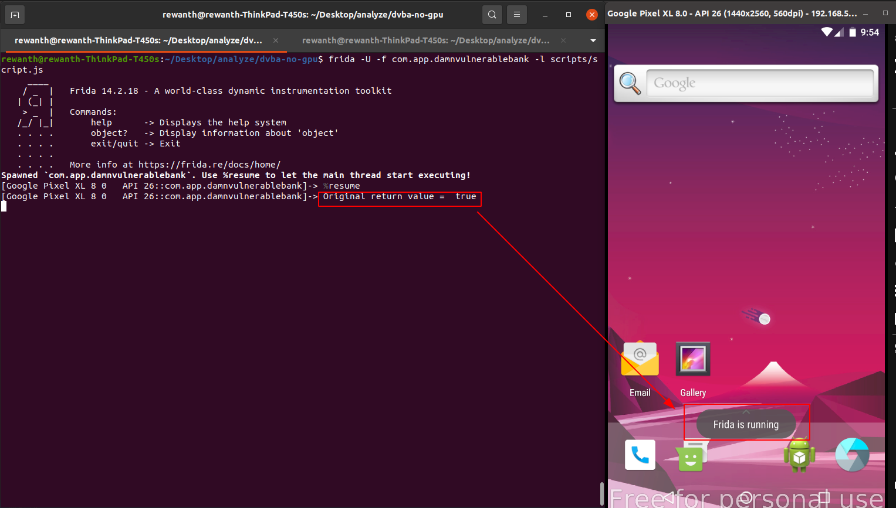

## Bypassing root detection check

In line 258, we can see an `if` block that makes the application run the block of code. Our target is to toggle the application code or process in a way that it doesn't enter this block of code.

There are multiple ways to achieve this task. According to the code,the return value of `a.R()`, at line 258 decides whether the application runs the block of code or not. If we can toggle the value of `a.R()`, we can solve the problem. We will use `frida` to perform this hack.

We now understand that we need to toggle `a.R()`. We need to hook the method, `a.R()` and toggle the function's return value to make the application work. Frida comes with Javascript API support to make things easier for us.

```javascript
// @File: scripts/script.js

setTimeout(function() {
    Java.perform(function() {

        // We are loading the class here
        var Rfunc = Java.use("a.a.a.a.a");

        // Whenever a.a.a.a.a.R() is called, the below code is executed
        Rfunc.R.implementation = function() {
            // Capture the return value of R function
            let retval = this.R();
            // Printing the value we got from this function
            console.log("Original return value = ", retval);
            // Toggle the return value to make sure it doesn't enter the if loop
            return !retval
        }
    })
}, 10);
```

Run the frida command to check it

```bash
frida -U -f com.app.damnvulnerablebank -l scripts/script.js 
```



We can see an error message after application crashed, `Frida is running`. This confirms the application is having another check to detect if we are trying to hook the application and tamper with it. If we are trying to hook it, the application crashes. Our target is to bypass this method hooking detection check.
