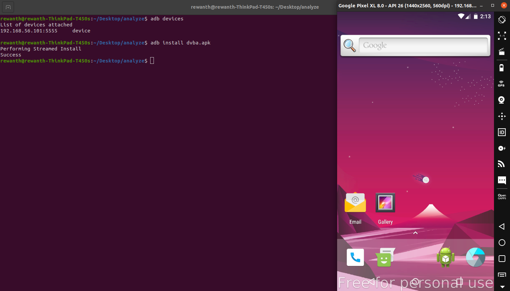

## Install Application

### Get the application running

Download the [apk](https://github.com/rewanthtammana/Damn-Vulnerable-Bank/raw/master/dvba.apk) from the repository. Try installing and running it.

### Install the application

I'm using genymotion as my emulator to install the application.

```bash
adb install dvba.apk
```



Application installed successfully.

### Run the application

Try running the application. It doesn't work.


Looks like the app isn't built to work in an emulator. Let's fix it :-)


### Issues while reversing (recompiling) the application with apktool

Depending on the apktool version, you might face an error recompiling the application. One of such error is `brut.common.BrutException`


The following commands can fix the error.

 ```bash
 apktool empty-framework-dir --force 
 apktool b dvba/ -o dvba-no-gpu.apk
 ```

