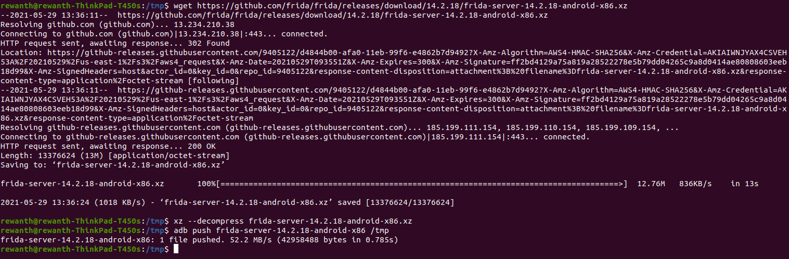
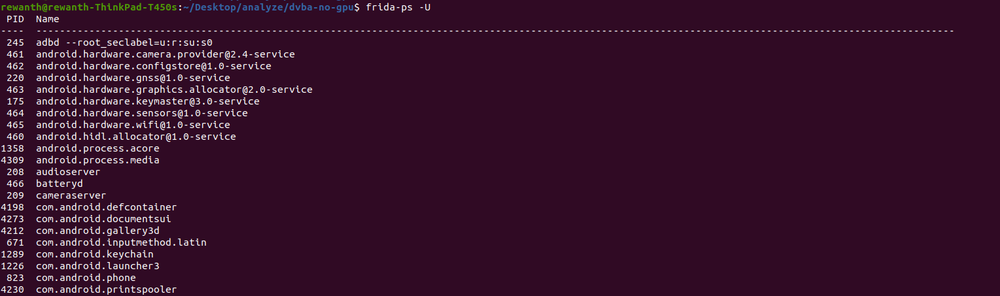

## Install tools

To get started with reviewing the android application, as a pre-requisite we need to install a few of tools for smoother testing. We will need the following tools:

* Android phone (rooted preferred) or emulator like genymotion, memu, etc.
* adb
* frida
* [apkx](https://github.com/b-mueller/apkx)
* apktool
* ghidra


### Install frida

First things first, we need to install frida-server on the target device. I'm using genymotion as my emulator which uses x86 as underlying architecture. Download, [here](https://github.com/frida/frida/releases/download/14.2.18/frida-server-14.2.18-android-x86.xz). If you are using android phone use arm downloadable, [here](https://github.com/frida/frida/releases)

Download the file, extract the executable and push it to the target device.

```bash
wget https://github.com/frida/frida/releases/download/14.2.18/frida-server-14.2.18-android-x86.xz
xz --decompress frida-server-14.2.18-android-x86.xz
adb push frida-server-14.2.18-android-x86 /tmp
```



Open shell on the emulator with `adb shell` and execute the file in the background

```bash
rewanth@rewanth-ThinkPad-T450s:/tmp$ adb shell
vbox86p:/$ cd tmp
vbox86p:/tmp$ ./frida-server-14.2.18-android-x86 &
```

The terminal might stop responding after running frida server in background. Don't panic, kill the session and open a new terminal for further operations.

Install frida client on the attacking machine.

```bash
pip install frida-tools
```

## Check frida status

```bash
frida-ps -U
```



If you are getting any different output, possible reasons are frida server might not be running or frida tools aren't installed properly. Refer to the tools page.

## Install docker and start backend server

TBD

## Install and configure burpsuite with emulator

TBD
